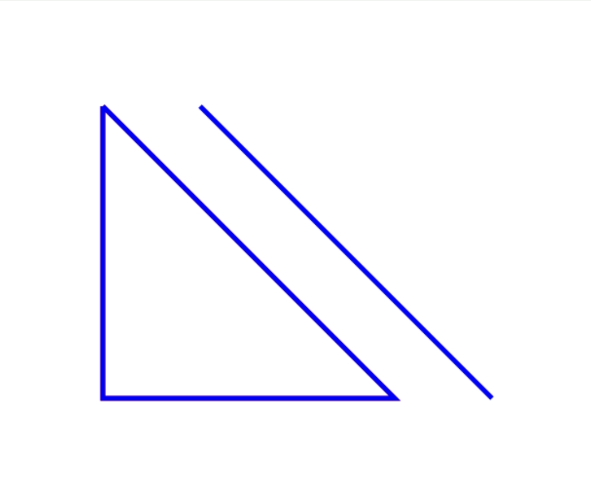

<!--
 * @Author: 汪珊
 * @Date: 2024-10-13 22:05:36
 * @LastEditors: error: error: git config user.name & please set dead value or install git && error: git config user.email & please set dead value or install git & please set dead value or install git
 * @LastEditTime: 2024-10-14 02:40:37
 * @FilePath: \undefinedd:\projects\春华秋实.md
 * @Description: 这是默认设置,请设置`customMade`, 打开koroFileHeader查看配置 进行设置: https://github.com/OBKoro1/koro1FileHeader/wiki/%E9%85%8D%E7%BD%AE
-->
1. 浏览器总在一个新打开、未命名的窗口中载入目标文档的用法是?
    ***答案：*** `<a href=““url”” target=““_blank””</a>`
2. HTML5中，哪个控件用于创建用户可以选择多个选项的列表？
    ***答案：*** `<select multiple>`
3. 在 HTML5 中 audio 元素不支持哪种音频格
式?
    ***答案：*** midi(扩展名 mid )
    >HTML5 Audio 标签能够支持 wav，mp3，ogg，acc，webm 等格式，但有个很重要的音乐文件格式 midi(扩展名 mid )却在名大浏览器中都没有内置的支持。
4. 针对以下代码，下面说法<u>错误</u>的是?
   ```js
    <canvas id=""myCanvas"" width=""400"" height=""300"">
    <script type=""text/javascript"">
        var c= document.getElementById(""myCanvas"");
        var cxt= c.getContext(""2d"");
        var img = new Image();
        img.src ="“图片路径"";
            img.onload = function(){
                cxt.drawImage(img,10，10);
        }
    </script>
   ```
   * 以 Canvas 画布上的坐标(10,10)为起始点，绘制图像
   * 实现了在 Canvas 中插入图片的功能
   * 一定要在图像加载完成后的回调中绘制图像，否则图像显示不出来
   * ***插入后图片会自动适应 Canvas 画布大小，无需手动调整***
    > `cxt.drawImage(img, x, y, x1, y1)`绘制图像
        `x,y` 为起始坐标
        `x1,y1` 为缩放宽高，单位px     
5. 在 HTML5 中，引入了应用程序缓存，带来的优势说法<u>错误</u>的是?
    * 离线浏览-用户可在应用离线时使用它们
    * 速度-已缓存资源加载的更快
    * 减少服务器负载-浏览器将只从服务器下载更新过或更改过的资源
    * ***增加服务器负载***
6. 在 HTML5 中关于 CSS 哪些属性可以继承?
   * ***font-size***
   * padding
   * width
   * border
    > 不可继承的样式：border， padding， margin ，width ，height ;
    可继承的样式：font-size ，font-family，color, UL LI DL DD DT;
7. 在 HTML 页面中制作一个头像，想要鼠标指向这个头像时浮出一条提示信息，应该使用的参数是?
    ***答案：*** alt 或 title
8. 在HTML5 Canvas中，以下JavaScript代码段执行后，画布上绘制的图形和线条的颜色分别是什么?
   ```js
    context.moveTo(100,100);
    context.lineTo(100,400);
    context.lineTo(400,400);
    context.lineTo(100,100);
    context.lineWidth=5;
    context.strokeStyle=""red""; // 设置线条颜色为红色
    context.stroke(); // 绘制红色四边形
    context.moveTo(200,100);
    context.lineTo(500,400);
    10
    context.strokeStyle=""blue""; // 设置线条颜色为蓝色
    context.stroke(); // 绘制蓝色线段
    context.closePath(); // 关闭路径，但不影响前述绘制
   ```
   ***答案：*** 画布上绘制的四边形颜色为红色，线段颜色为蓝色 
   >*注：原题（8月20日题3）按照题目描述四个选项全部错误，给出的“正确答案”对图形和颜色的描述都有误*
   ***完全按照题目描述得出答案如图***
   
   如果要绘制出正确答案中的一个红色图形，一个蓝色图形，则需要在每次绘制图形之前加上`context.beginPath();`
9. 我们想要在框架中加入一个叫做 list.htm 的文件，应该在 HTML 中如何描述它?
    ***答案：*** frame src= "list.htm"
10. 关于 HTML5 的离线储存的工作原理，理解<u>错误</u>的是?
    * 在用户没有与因特网连接时，可以正常访问站点或应用
    * 离线存储是基于一个新建的 .appcache文件的缓存机制
    * 页面头部下面需要加入 manifest 属性才能实现离线存储
    * ***离线之后重新连线时会重新下载文件中的资源并进行离线存储***
    > 1. 是缓存机制不是存储技术
    > 2. 需要manifest属性
    > 3. 浏览器会对比新的 manifest 文件与旧的manifest 文件如果文件没有发生改变，就不做任何操作如果文件改变了，那么就会重新下载文件中的资源并进行离线存储
    > 4. 离线情况下，浏览器会直接使用离线存储资源
11. 以下哪一个<u>不属于</u> HTML5 元素?
    * \<header>
    * \<footer>
    * \<section>
    * ***\<content>\</content>***
    >‌
    **HTML5元素主要包括以下几个核心元素‌：**
    ‌doctype元素‌：告诉浏览器处理的是HTML文档，并标记文档内容所属的HTML版本。
    ‌html元素‌：被称作根元素，包含文档的所有其他元素。
    ‌head元素‌：包含文档的元数据，如标题、字符集声明等。
    ‌body元素‌：包含文档的主要内容，是html元素的第二个子元素。
    ‌title元素‌：设置文档的标题，显示在浏览器标签上。
    ‌base元素‌：设置相对URL的解析基准，用于解析文档中的相对链接。
    ‌**HTML5新增的布局元素包括‌：**
    ‌header元素‌：用于网页的头部，定义头部的区域块。
    ‌footer元素‌：与header元素类似，但用于网页的底部内容。
    ‌nav元素‌：用于定义导航栏、目录或超链接。
    ‌article元素‌：用于定义一个独立的内容区块，如一篇博客或文章。
    ‌aside元素‌：用于定义其所包含的内容与页面主要内容无关。
    ‌section元素‌：用于文档中的一节，包含标题和内容。
    ‌**其他常见的HTML5元素还包括‌：**
    ‌meta元素‌：提供关于HTML文档的元数据。
    ‌link元素‌：用于引入外部资源，如CSS文件。
    ‌style元素‌：用于定义内部样式表。
    ‌input元素‌：用于创建输入字段，HTML5引入了多种类型的input，如日期、范围、颜色等。
    ‌output元素‌：用于表示计算或脚本的结果。
    ‌address元素‌：用于提供作者的联系方式。
    ‌progress元素‌：表示任务的进度条。
    ‌meter元素‌：表示已知数值的范围内的标量测量。
    ‌figure和figcaption元素‌：一起使用，表示图文组合。
    ‌fieldset和legend元素‌：用于创建表单中的字段集和字段集的标题。
    ‌script元素‌：用于嵌入或引用执行脚本。
    ‌bdi元素‌：用于标记文本，确保按原始方向显示。
    ‌details和summary元素‌：提供可展开/折叠的内容区域。
    ‌dialog元素‌：表示对话框，可用于创建模态窗口。
    ‌mark元素‌：用于高亮显示文本。
    ‌time元素‌：表示时间。
    ‌datalist元素‌：提供预定义的选项列表，供input元素使用。
12. HTML5中，哪个元素用于表示页面中的一个独立的区域，通常与页面上的其余内容分隔开来?
    ***答案：*** `<section>`
13. 在HTTP协议中，关于请求方法的描述，哪一个是<u>不正确</u>的?
    * DELETE 方法用于请求服务器删除指定的资源
    * ***GET 方法用于向服务器请求数据，并且可以包含在请求体中发送给服务器***
    * POST 方法用于向指定资源提交数据进行处理请求，例如提交表单或者上传文件，数据被包含在请求体中
    * PUT 方法用于从客户端向服务器传送的数据取代指定的资源的内容
14. 关于 worker 主线程的特性，叙述<u>错误</u>的是?
    * 通过 worker = new Worker( url )创建-个worker
    * 通过 worker.postMessage( data)向worker 发送数据
    * ***绑定 worker.getmessage 方法来接收worker 发送过来的数据***
    * 使用 worker.terminate()来终止一个worker 的执行
    >
        创建实例并返回 worker =new Worker(url)
        发送数据 worker.postMessage(data)
        接收数据 worker.onmessage
        终止执行 worker.terminate()
15. 以下是一段用于实现拖拽功能的 JavaScript 代码，则选项中说法<u>错误</u>的是?
    ```js
    var con = document.getElementById(""con""); 
    con.addEventListener(""dragover""", 
        function(e){
            e.preventDefault();
    })
    con.addEventListener(""drop"", function (e) {
        var file0bj = e.dataTransfer.files[0]; 
        var reader = new FileReader(); 
        reader.readAsDataURL(fileObj); 
        reader.onload = function () {
            var imgData = reader.result;
            var imgNode = document.createElement(""img"")
            imgNode.src = imgData;
            imgNode.style.width = ""200px""; 
            imgNode.style.height = ""150px"";
            con.appendchild(imgNode);
        })
        document.ondrop = function (e) { e.preventDefault(); };
    ```
    * `e.dataTransfer.files[0]`获取的是拖拽经过 `con` 区域的第一个文件对象
    * ***`reader.readAsDataURL(fileObj)`的读取文件操作过程是同步处理的***
    * `document.ondrop = function(e){e.preventDefault();}`的作用是阻止文档页面的默认行为
    * 这段代码实现的功能是可以将本地的图片拖拽到con 中，并进行该图片的显示
    > `reader.readAsDataURL(fileObj)`为异步处理，操作完成后会触发`onload`回调
16. 有关下述代码中的地理位置定位过程，下列说法<u>错误</u>的是?
    ```js
    window.onload = function () {
        var oInput = document.getElementById('input');
        oInput.onclick = function () {
            navigator.geolocation.getCurrentPosition(function (position) {
                var y = position.coords.longitude;
                var x = position.coords.latitude;
                console.log(x, y);
                var map = new BMap.Map(""div1"");
                var pt = new BMap.Point(y, x);
                map.centerAndZoom(pt, 14);
                map.enablescrollWheelZoom();
                var myIcon = new BMap.Icon(""logo.png"", new BMap.Size(48, 48));
                var marker2 = new BMap.Marker(pt, {
                    icon: myIcon
                });
                map.addOverlay(marker2);
                var opts = {
                    width: 200,
                    height: 60,
                    title: ""test""}
                var infoWindow = new BMap.InfoWindow(""test"",opts);
                map.openInfoWindow(infoWindow, pt);
            });
        };
    };
    ```
    * 可以用`if(navigator.geolocation){}`于判断当前浏览器是否支持地理位置定位
    * ***`navigator.geolocation.getcurrentPosition(function(position){})`此处为同步调用过程***
    * 
        ```js
            var myIcon = new BMap.Icon(""logo.png"", new BMap.Size(48, 48));
            var marker2 = new BMap.Marker(pt, {
                icon: myIcon
            });
            map.addOverlay(marker2);
        ```
        上述代码为在特定坐标位置添加标志物

     
    * 
        ```js
            var infoWindow = new BMap.InfoWindow(""test"",opts);
            map.openInfoWindow(infoWindow, pt);
        ```
        上述代码为创建信息窗口，并打开窗口过程
17. 在以下JavaScript 代码中，关于localStorage 的使用，哪个说法是<u>错误</u>的?
    ```js
    if (!window.localstorage) {
        alert(""浏览器不支持 localstorage"");
    } else {
        var storage = window.localstorage; 
        var data = {
            name: 'xiecanyong',
            sex: 'man',
            hobby: 'program'
        }
        var d = JSON.stringify(data);
        storage.setItem(""userData"", d);
        console.log(storage.getItem(""userData""));
    }
    ```
    * 如果浏览器不支持 localStorage，代码会弹出提示框告知用户
    * ***localStorage 中的数据仅在当前页面会话期间有效，页面关闭后数据会丢失***
    * 可以使用 setltem 方法将数据存储到localStorage 中，并通过键名访问
    * localStorage 提供的存储空间大小通常约为 5MB
18. 以下哪种方法可以解决HTML5新标签的浏览器兼容问题?
    ***答案：*** 使用Polyfills库
    >使用IE条件注释:IE条件注释是一种特殊的注释语法，可以根据IE浏览器的版本来加载不同的代码。虽然可以用条件注释来解决IE浏览器的兼容性问题，但它并不适用于其他不支持HTML5新标签的浏览器。
    使用JavaScript创建新标签的替代方案:通过JavaScript动态创建新标签的替代方案是一种解决方法，但它需要复杂的代码，并且会导致性能问题。
    使用HTML5 Shiv库:HTML5 Shiv库是一个用于解决IE浏览器中对HTML5新标签不识别的问题的库，但它并不适用于其他不支持HTML5新标签的浏览器。
19. 有关以下画布操作代码，下列说法正确的是?
    ```js
    context.moveTo(100, 100);
    context.lineTo(100, 400);
    context.lineTo(400, 400);
    context.lineTo(100, 100); 
    context.lineWidth = 5;
    context.strokeStyle = ""red"";
    context.stroke();
    context.moveTo(200, 100); 
    context.lineTo(500, 400); 
    context.strokestyle = ""blue"";
    context.stroke();
    context.closePath();
    ```
    ***答案：*** 该程序最终绘制的线的颜色均为蓝色
20. （和上一题重复）
21. 下面关于 background-attachment 描述<u>错误</u>的是哪一项?
    * ***initial 表示相对于子元素固定***
    * fixed 表示相当于父元素定位
    * local 表示相对于元素内容固定
    * scroll 表示相对于元素本身固定
    > initial为初始化值，默认排列方式
22. opacity 值的范围是什么?
    ***答案：*** [0.0 - 1.0]
23. 在CSS3中，如果想让文本在块级元素中水平居中，应该使用哪个属性?
    ***答案：*** text-align：center
    >text-align: center 是用于设置文本内容在块级元素中水平居中对齐的属性。它确保文本内容在元素内部水平居中显示。
    margin: auto 通常用于块级元素，以实现水平居中，但它本身并不直接用于文本对齐。而是当元素的宽度被指定时，左右外边距会自动调整，使得元素在父元素中水平居中。
    vertical-align: middle 用于设置行内元素或表格单元格的垂直对齐方式，而不是用于块级元素中的文本水平对齐。
    justify-content:center是Flexbox布局中的一个属性，用于在主轴上居中子元素。它并不直接用于文本的水平对齐。
24. 在 CSS3 中，哪个属性可以在两种或多种指定颜色之间显示平滑过渡?
    ***答案：*** gradients
25. 下述代码解释中，<u>不正确</u>的是?
    ```css
    :root {
        --navColor: #c00;
        --navPadding: 10px;
    }

    selector {
        --nameFont: italic smal1-caps 400 12px / 20px'微软雅黑';
        --boxBorder: 2px solid rgba(0, 0, 0, .2);
    }

    selector {
        --borderwidth: 8px;
        --bordercolor: red;
        --borderstyle: solid;
        --border: var(--borderWidth) var(--borderColor) var(--borderstyle);
        border: var(--border);
    }    
    ```
    * 从上面可以看出在css中定义变量和声明一条css规则差不多只是前边使用两个中横线后边跟着变量名
    * 上面的代码 :root 中定义的变量为全局变量可以在任何元素中使用
    * 上面的代码 selector 中定义的变量为局部变量，只能在选择器范围内，和他的子元素中使用
    * ***上面的代码 :root 中定义的变量为局部变量，可以在任何元素中使用***
26. 哪个度量定义了相对于字体 x 高度的度量?
    ***答案：*** ex
27. 如果某个特定规则永远不应被另一个规则覆盖，应使用哪个指示?
    ***答案：*** !important
28. 如何居中一个浮动元素?
    ***答案：*** 
    ```css
    .container {
        position: relative;
    }

    .floated-element {
        float: left;
        position: relative;
        left: 50%;
        transform: translateX(-50%);
    }
    ```
    >`translateX(-50%)`的50%是相对于自身的
29. 假设有一个 div，如何实现从头部开始的线性渐变，从红色开始，转为黄色，再到蓝色?
     ```css
    #grad {
        background: linear-gradient(to bottom, red, yellow, blue);
    }
    ```
    >默认从上到下（180°）
30. 关于 CSS3 媒体查询，媒体类型<u>不包括</u>哪一个?
    * braille
    * projection
    * ***phone***
    * tty
    >   all:全部媒体类型。
        braille:盲文触摸装置。
        embossed:分页盲文打印机。
        handheld:小屏幕和流量有限的手持设备。
        print:提供给打印机的样式，最常用的介质类型，打印页面时获得适合阅读的效果。
        projection:投影，给投影机使用。
        screen:彩色屏幕，最常用的介质类型，般和屏幕大小表达式联合使用。
        speech:语音朗诵，用于屏幕阅读软件
        tty:固定间距字符网格，例如功能机那样的。
        tv:智能电视设备。
31. 以下<u>不属于</u> font-size 的可能值的单位是什么?
    * ***M***
    * em
    * rem
    * %
32. 下列哪个选择器用于选择id为example的元素?
    ***答案：*** #example
33. 在没有指定扩散方式时的 box-shadow 中第二个属性值表示什么?
    ***答案：*** 垂直偏移量
  >可设置的值按顺序包括阴影的 X 轴偏移量、Y 轴偏移量、模糊半径、扩散半径和颜色  
34. 对于 filter 和 box-shadow 描述<u>错误</u>的是什么?
    * ***下沉边框效果都会被盒子自身背景色遮住***
    * box-shadow 兼容性更好
    * 都可以绘制边框
    * filter 有些特性不能全部使用
    > filter绘制出的投影效果不会被背景色遮住
35. CSS3 中，关于 3D 转换的旋转函数功能，下面不相等的是?
    *    ```js
            rotateX(a)
            rotate3d(1,0,0,a)
    *    ```js
           rotateY(a)
           rotate3d(0,1,0,a)
    *    ```js
            答案：
            rotateZ(a)
            rotate3d(0,1,0,a)   
    *    ```js
            rotateZ(a)
            rotate3d(0,0,1,a)
36. 对于 background-size 描述正确是哪一项?
    ***答案：*** 设置背景图片大小
37. 如何使一个绝对定位的元素左右居中?
    ***答案：*** 
    ```css
    {
        border: 1px solid black;
        position: absolute;
        width: 200px;
        height: 100px;
        margin: 0 auto;
        left: 0;
        right: 0;
    }
    ```
38. 定义元素过渡过程中，由慢开始、到快、再到慢结束的运动曲线函数是什么?
    ***答案：*** ease
    >ease:默认值，慢速开始，快速变快，慢速结束;linear:匀速;ease-in:由慢变快;ease-out:由快变慢。
39. 下列哪种布局模式是将对象作为弹性伸缩盒显示?
    ***答案：*** Flexbox
40. 下面哪个元素被称为媒体元素的子元素?
    ***答案：*** \<track>
41. 假设我们要在另外一个文件使用一个已知模块，此时应该如何操作?
    ***答案：*** 使用 import 关键字来导入
42. 以下哪项<u>不可以</u>作为类型的引入方式?
    * 接口声明
    * 枚举声明
    * 类型别名声明
    * ***声明ur地址引入***
43. 下列选项中对TypeScript设计之依赖倒置原则的理解，<u>不正确</u>的是?
* 抽象不应该依赖于细节，细节应当依赖于抽象
* ***要针对实现编程，而不是针对接口编程***
* 传递参数时或在关联关系中，尽量引用层次高的抽象层类
* 类应当只实现接口或抽象类中声明过的方法，而不要给出多余的方法，否则将无法调用到在子类中增加的新方法
44. 以下关于ts包管理工具(TypescripDefinition Manager)描述<u>错误</u>的是?
    * 相关包放在@types的scope中
    * 安装定义包与安装普通npm包一样
    * 从DefinitelyTyped中搜索并安装
    * ***引用第三方包必须使用tdm安装对应的文件定义包***
45. 假设我们要设计一个基于TypeScript的银行转账系统，请问应该采用哪种结构模式?
    ***答案：*** 桥接模式
46. 假设我们在使用接口隔离原则时，将接口设计的太小，请问可能会出现什么情况?
    ***答案：*** 接口泛滥
    > 设计的太大会违背隔离原则
47. 对TypeScript与JavaScript的解释，<u>有误</u>的选项是?
    * JavaScript没有static类型，但是TypeScript支持
    * JavaScript不支持interface
    * TypeScript支持类型定义
    * ***JavaScript想使用es的高级功能，必须使用TypeScript***
48. TypeScript支持3种不同的访问权限来保护对类、变量、方法和构造方法的访问，下列哪个选项<u>不是</u>正确的访问控制符?
* public
* protected
* ***share***
* private
49. ts中是否需要“Use Strict”?
     ***答案：*** 看配置
50. 假设我们要设计一个系统，基于接口隔离原则，下列哪项设计是<u>错误</u>的?
    * 不使用单一的总接口
    * 使用多个专门的接口
    * 每一个接口应该承担一种相对独立的角色
    * ***客户端需要的行为则隐藏起来***
51. 假设我们要构建一个需要频繁地进行创建和销毁对象的系统，且该系统使用频率较高，请问应该使用什么模式?
    ***答案：*** 单例模式
    >单例模式适用于需要频繁地进行创建和销毁对象、创建对象耗时或耗资源过多但又经常用到的场景
    简单工厂模式适用于工厂类负责创建的对象较少、客户端对如何创建对象不关心的场景;
    工厂方法模式适用于所有生成对象的地方都可以使用(权衡代价)、需要灵活且可扩展的框架的场景;
    抽象工厂模式适用于无需关心对象创建的过程、系统有多于一个的产品族且每次只需要某一个产品族、产品等级结构稳定的场景
52. 以下对TypeScript适配器设计模式的说明<u>错误</u>的是?
    * 适配器是一种结构型设计模式，能使不兼容的对象能相互合作
    * 适配器可担任两个对象间的封装器，接收对一个对象的调用，并将其转换为另一个对象可识别的格式和接口
    * 适配器模式在TypeScript代码中很常见。对于一些遗留代码的系统常使用它，让遗留代码与现代的类得以相互合作
    * ***TypeScript一个适配器只能适配一个类，因为TypeScript类不支持多继承***
    > 一个适配器可以把适配者类和它的子类都适配到目标接口
53. TypeScript 中，以下哪种方式可以用于引入值?
    ***答案：*** function声明、let声明、包含值的namespace或module声明
54. TypeScript中，下列哪项<u>不是</u>正确的编译选
项?
    * -baseUrl
    * ***-ignoreWarning***
    * -allowJs
    * -inlineSources
55. 以下代码的执行输出结果为?
    ```js
    let a ='a';
    let b= new String('a');
    console.log(a==b) 
    ```
    ***答案：*** TRUE
56. 如何在interface中定义一个静态属性?
    ***答案：*** 不能定义
57. 对于接口MyInterface，正确的实现类是?
    ```ts
    interface MyInterface{
        m1(): any;
    }
    ```
    ***答案：*** 
    ```ts
    abstract class MyClass implements MyInterface {
        abstract m1();
    }
    ```
58. 假设存在一段TypeScript代码，请问这段代码编译并执行的结果是什么?
    ```ts
    class Person{ }
    var obj= new Person();
    var isPerson = obj instanceof Person;
    onsole.1og("obj对象是 Person类实例化来的吗?"+isPerson)
    ```
    ***答案：*** `obj 对象是 Person 类实例化来的吗?true`
59. 如何获取枚举名?
    ***答案：*** 
    ```ts
    enum Enum {
        A
    }
    Enum[Enum.A];
    ```
60. 关于type与interface的异同<u>错误</u>的是?
    * type不能继承，interface可以
    * type不能merge，interface可以
    * type 可以通过 typeof动态设 置interface不行
    * ***interface与type可以声明同样的类型***
    >interface仅能定义类与函数，type可以定义所有类型
61. 下面的代码打印出来的结果是?
    ```ts
    class Animal
    {
        public name;
        constructor(name){
            this.name = name;
        }
        move(meters){
            alert(this.name +"moved"+ meters+".m");
        }
    }
    class Horse extends Animal
    {
        constructor(name){
            super(name);
        }
        move(){
            alert(super.name +" moving");
            super.move(45);
        }
    }
    var tom:Animal =new Horse("tom")
    tom.move(34)
    ```
    ***答案：*** `undefined movingtom moved 45m.`
    >super指的原型类，而不是原型的实例
62. 对于TpyeScript继承类的方法重写，以下说法<u>不正确</u>的是?
    * ***方法重写时this关键字是对父类的直接引用***
    * 该方法必须具有与父类相同的名称
    * 该方法必须具有与父类相同的参数
    * 必须有一个继承关系
    >super是对父类的直接引用
63. 下列有关于条件渲染的说法<u>错误</u>的是哪个?
    * ***v-show可以用在template***
    * v-if可以用在template
    * 当v-if与 v-for 一起使用时v-for 具有比 v-if 更高的优先级
    * v-show 和 v-if 实现切换 dom 元素的原理不一样
64. 关于 computed 说法，下列哪个选项是对的?
    ***答案：*** 计算属性将被混入到 vue实例中。所有getter和setter的this 上下文自动地绑定为 Vue 实例
65. 以下关于`<a v-bind:href="url">...</a>`说法正确的是
    ***答案：*** href 是指令的参数
    >v-bind 不是一个指令，而是 Vue.js 提供的用于绑定动态数据的指令语法。href 在这里是要绑定的属性名称，而 url 不是指令的参数,而是在组件的 data 或计算属性中定义的变量或表达式。
66. 下列利用渲染函数写修饰符<u>错误</u>的是?

    *    
        ```js
                on: {
                    '!click':this.SomeFunction,
                }
        ```
    *    
        ```js
                on: {
                    '~keyup':this.SomeFunction,
                }
        ```
    *   ***答案：*** 
        ```js
                on: {
                    '--dbclick':this.SomeFunction,
                }
        ```
    *    
        ```js
                on: {
                    '~!mouseover':this.SomeFunction,
                }
        ```
    >渲染函数下修饰符:
    `&`为`.passive`、`~`为`.once`、`!`为`.capture`
67. 假设正在开发一个复杂的Vue3组件，并需要使用高阶响应式和组合式AP。下面哪个选项描述了Vue3的高阶响应式和组合式API的正确使用方式?
    ***答案：*** 在组件中定义一个计算属性，使用高阶响应式对其进行监听;使用组合式API在组件的“setup”函数中，创建一个名为“useCount”函数，接受一个默认值作为参数，并返回一个响应式的“count”和两个方法，分别用于增加和减少计数器。      
68. 以下哪个<u>不是</u>事件的修饰符
    * .self
    * ***.lazy***
    * .once
    * .prevent
    >.lazy是v-model的修饰符
69. Vue-router跳转和location.href, 说法<u>错误</u>的是?
    * 使用`location.href= /url`来跳转，简单方便，但是刷新了页面;
    * 使用 `history.pushState(/ur1)`，无刷新页面，静态跳转;
    * 引进`router`然后使用`router.push(/url)`来跳转，使用了`diff` 算法，实现了按需加载，减少了 `dom` 的消耗。
    * ***使用`router`跳转和使用`history.pushstate()`原理不同。***
70. 路由的匹配规则为`{path:'/user/:name'}`,当从`/user/sid` 跳转到`/user/moon`时，下列说法正确的是?
    ***答案：***  计算属性中使用了`this.$route.params.name`，会自动执行
    >当路由参数发生变化时，组件不会重新创建，因此<u>不会触发beforeCreate 或created 生命周期钩子</u>。但是，如果组件已经被挂载，beforeRouteUpdate 守卫会执行，因为它是专门用来处理路由参数或查询变化时的守卫。
71. Vuex 和 localStorage 的区别，说法<u>错误</u>的是?
    * vuex存的是状态，存储在内存；localStorage是浏览器提供的接口，存的是接口，以文件的形式存储到本地
    * vuex用于组件之间的传值，localStorage则主要用于页面之间的传婚
    * 当刷新页面时，vuex存储的值会丢失localStorage不会
    * ***刷新页面时localstorage存储的值不会丢失，vuex也不会。***
72. 以下<u>不属</u>于使用 `v-on` 的优势的是?
    * 能轻松定位在 JavaScript 代码里对应的方法。
    * 无须在 JavaScript 里手动绑定事件，ViewModel 代码是非常纯粹的逻辑，和DOM 完全解耦，更易于测试。
    * 当一个 ViewModel 被销毁时，所有的事件处理器都会自动被删除。
    * ***处理业务逻辑的时候能更方便,更直观***
    >使用v-on的好处有:
        1.能轻松定位在 JavaScript 代码里对应的方
        法。
        2.无须在 JavaScript 里手动绑定事件ViewModel代码是非常纯粹的逻辑，和DOM 完全解耦，更易于测试。
        （个人理解因为和解耦了所以和业务逻辑相对比较独立，不太直观？）
        3.当一个 ViewModel被销毁时，所有的事件处理器都会自动被删除。
73. 什么时候使用v-if ?
***答案：*** 判断dom元素是否加载 减少性能消耗
74. 下列<u>不是</u>Vue3自定义指令钩子函数的是?
    * `created()`
    * `beforeMount()`
    * `mounted()`
    * ***`afterUpdate`***
75. Vue组件中写name选项搭配keep-alive，作用
是?
    ***答案：*** 项目使用 keep-alive 时，可搭配组件name 进行缓存过滤
76. vue中mixins和extends说法<u>错误</u>的是?
    * extend用于创建vue实例
    * mixins可以混入多个mixin
    * extends只能继承一个，mixins类似于面向切面的编程(AOP)，extends类似于面向对象的编程
    * ***Vue.extend>mixins>extends***
    > Vue.extend>extends>mixins
77. 下面哪个是递归组件?
    ***答案：*** 
    ```js
         <template>
            <div>
                <template v-for="menu in list">
                    <treeMenu :key="menu.id" :list='menu.children'></treeMenu>
                </template>
            </div>
        </template>
        <script>
            export default {
            props:['list'],
            name: 'treeMenu",
            data(){
                return {}
            }
        </script>
    ```
    >递归组件要求组件要有 name 字段。组件的使用名要与 name 名一致。
78. 下列关于MVVM理解<u>错误</u>的是?
    * View 是视图层，也就是用户界面。前端主要由 HTML 和 CSS 来构建
    * Model 是指数据模型，泛指后端进行的各种业务逻辑处理和数据操控，对于前端来说就是后端提供的 api 接口。
    * ViewModel是由前端开发人员组织生成和维护的视图数据层。
    * ***视图层的数据状态也封装在了 Model层里***
    >视图的状态和行为都是ViewModel中封装出来的数据模型
79. 下列关于mixin的说法<u>错误</u>的是?
    * 在data的property发生冲突时，会以组件自身的数据为优先
    * 在data的property发生冲突时，会以组件自身的数据为优先
    * ***mixin对象的钩子函数将在组件自身钩子之后调用***
    * 在methods的方法名发生冲突时，会以组件自身的方法优先
    >理解成一切都是组件优先，组件的属性、行为会覆盖mixin的（即在mixin之后执行）
80. 关于动态组件说法<u>错误</u>的是?
    * 动态组件默认会触发组件的生命周期
    * 动态组件通过标签component和is属性来切换不同组件
    * ***在动态组件上使用keep-alive会触发组件的生命周期***
    * 在动态组件上使用keep-alive不会触发组件的生命周期
81. 在 Vue.js 中，如何为具名插槽提供默认值?
    ***答案：*** 在父组件中定义一个不带 name 属性的元素作为默认插槽
82. 下列关于指令的理解，<u>错误</u>的是?
    * 指令(Directives)是带有 v-前缀的特殊attribute
    * ***指令attribute 的值仅针对单个JavaScript 表达式有效***
    * 指令的职责是，当表达式的值改变时将其产生的连带影响，响应式的作用于DOM
    * 指令 attribute 的值也可以针对多个JavaScript 表达式有效
    > v-for的预期值是多个表达式
83. 下列<u>不是</u>get请求的是?

    *  
        ```js
         axios.get('/test')
        .then(function(response){
            console.1og(response);
        })
        .catch(function(error{
            console.log(error);
        })
        ```
    *  
        ```js
         axios({
            url: '/test'
         })
        ```
    *  
        ```js
        axios({
            url: '/test',
            method: 'get'
         })
        ```
    *   ***答案：*** 
        ```js
        axios({
            url: '/test',
            method: 'post'
         })
        ```
84. 规定请求时请求方法类别的请求配置是
    ***答案：*** method
85. 下列说法<u>错误</u>的是?
    * ***axios 可以自定义错误状态码***
    * axios 使用`config.validateStatus`来定义请求是否成功
    * axios 的 `config.validatestatus` 默认值为
    `status =>status>=200&& status<
    300`
    * axios 可以根据状态码修改请求失败或成功的情况
86. 关于axios并发请求说法<u>错误</u>的是?
    * 并发的助手函数需要配合使用
    * 并发的助手函数分别是:`axios.all()`、
    `axios.spread`
    * 助手函数 `axios.all()`接受axios请求数组作为参数
    * ***助手函数 `axios.spread()`接收响应数组作为参数***
    > `axios.spread()`接受回调函数作为参数
87. 对axios错误处理，认识正确的是?
    ***答案：*** 只要拦截器返回Promise.reject(error)就可以用catch继续捕获错误
88. 以下哪个是Axios的head请求?
    ***答案：*** 
    ```js
    axios({
        method: 'head',
        url:'/test'
    });
    ```
89. 下列哪个是delete请求?
    ***答案：*** 
    ```js
    axios.delete('/test')
    .then(function(response){
        console.log(response);
    })
    .catch(function(error){
        console.log(error);
    });
    ```
90. 以下是关于axios的一系列说法，<u>错误</u>的是?
    * 会先进行axios请求正常获取到返回后config.validateStatus的校验
    * axios 请求正常获取到返回后config.validateStatus校验失败后会返回一个错误对象
    * 返回的错误对象是经过包装后的错误d对象
    * ***返回的错误对象是通过new Error(msg)得到的对象***
91. 关于创建实例方法说法<u>错误</u>的是?
    * 创建实例方法为 axios.create()
    * axios.create()创建实例没有create()方法
    * ***axios.create()创建实例有create()方法***
    * 参数为自定义配置对象axios.create()
92. 关于axios的getUri方法说法正确的是?
    ***答案：*** getUri可根据配置获取发起请求的ur
93. 0923题目
